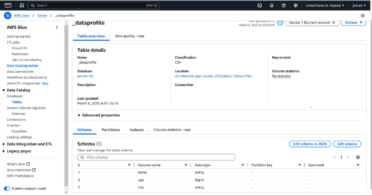
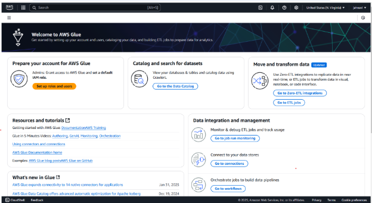
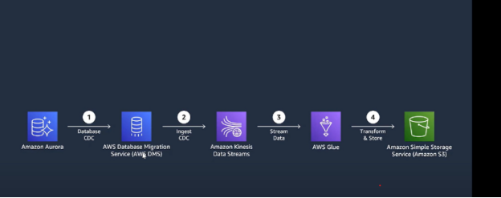
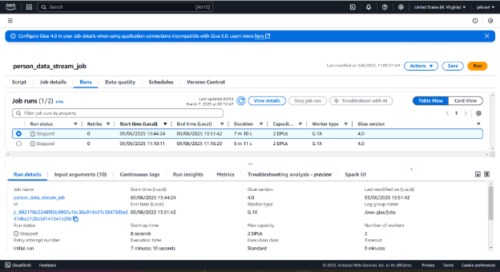
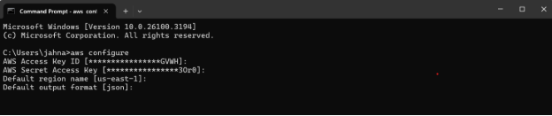

`                                       `**GLUE SERVICE&S3**

**What is glue?**

AWS Glue is a fully managed ETL (Extract, Transform, Load) service that helps move and process data between different sources and destinations. It automatically discovers, prepares, and transforms data for analytics using services like Amazon S3, Redshift, and Athena. It simplifies data integration by handling schema detection, job scheduling, and execution.

**What is AWS Glue Data Catalog?**

AWS Glue Data Catalog is a centralized metadata repository that stores metadata information about data stored in various sources such as Amazon S3, Amazon RDS, and other databases. It acts as a metadata store for AWS Glue ETL (Extract, Transform, Load) jobs and services like Amazon Athena, Redshift Spectrum, and AWS Lake Formation. The catalog helps organize, discover, and manage structured and semi-structured data in the cloud.

**What is an AWS Glue Crawler?**

An AWS Glue Crawler is a service that automatically scans data sources such as S3, DynamoDB, or JDBC databases to infer schema and populate the Glue Data Catalog with metadata tables. The crawler automatically detects schema changes and updates the catalog accordingly.

**Steps to Create a Table in AWS Glue Catalog Using a Crawler**

**1. Upload Data to Amazon S3**

- Navigate to **Amazon S3** from the AWS Management Console.
- Select or create a bucket (e.g., dataset-glue-bucket-2025).
- Inside the bucket, create a folder structure (e.g., data/dataprofile/).
- Upload a CSV file (e.g., profile\_data.csv) to the folder

**2. Create an IAM Role for the Glue Crawler** 

1. Open the **AWS IAM Console**.
1. Go to **Roles** and click **Create role**.
1. Give your role a name (for example: glue-crawler-role).Attach the necessary permissions. 
1. Click **Create role** to finish.

**3. Create an AWS Glue Database**

- Open the **AWS Glue Console**.
- Navigate to **Data Catalog > Databases**.
- Click **Add Database** and provide a name (e.g., person-db).

`            `Save the database.

**4. Create an AWS Glue Crawler**

- In the **AWS Glue Console**, go to **Crawlers**.
- Click **Create Crawler** and provide a name (e.g., person-crawler).
- Define the data source as Amazon S3 and specify the path (s3://dataset-glue-bucket-2025/data/dataprofile/).
- Assign the **IAM Role** (glue-crawler-role).
- Choose the target database (person-db).
- Schedule the crawler or run it on demand.
- Click **Create Crawler** and run it.

**5. Verify the Table in AWS Glue Catalog**

- Navigate to **AWS Glue Console > Data Catalog > Tables**.
- The crawler should have created a table (e.g., \_dataprofile) with schema inferred from the uploaded CSV file.
- Open the table to check the schema (e.g., columns name, age, city).
- The **classification** should be CSV, and the location should point to the S3 path.

**Key point** 

- Now we can query this table using Amazon Athena or process it using AWS Glue ETL jobs.
- When querying this table in Amazon Athena, the results will match the data originally uploaded to S3 before running the Glue Crawler.
- Athena reads directly from S3 using the schema stored in the Glue Data Catalog.

**SELECT \* FROM person-db.\_dataprofile LIMIT 10;**

**Conclusion**

By following these steps, we successfully created a table in AWS Glue Data Catalog using a crawler. The Glue Crawler helps automate the process of schema detection and metadata management, making data discovery and integration seamless across AWS services.

**GLUE SERVICE:**

This AWS Glue service page provides a starting point for managing ETL workflows.

**Prepare your account for AWS Glue**: we need to set up IAM roles and user permissions to allow AWS Glue to access data sources and execute jobs. 

**Catalog and search for datasets**: Use Crawlers to automatically detect, structure, and store metadata of our data in the Glue Data Catalog. 

**Move and transform data**: Choose between **Zero-ETL** for real-time data replication or **ETL jobs** to process and transform data using code, visual tools, or notebooks.

**AWS Glue Studio**

**Visual ETL** – Drag and drop components in a graphical interface to build ETL workflows without writing code.

**Notebook** – Use an interactive notebook environment (Jupyter-style) to write and execute code for data transformations.

**Script Editor** – Write and edit Python or Scala scripts directly to have full control over ETL logic.

Each method provides flexibility based on our preference and expertise.

**These are the required AWS services for a real-time data pipeline:**

**Step1**:Amazon Aurora (RDS) (which can use PostgreSQL) stores the database.

**Step2**:AWS DMS captures any changes (CDC - Change Data Capture) happening in the database.

**Step3:**Amazon Kinesis streams these captured changes in real-time.

**Step4**:AWS Glue processes and transforms this data using PySpark.

**Step5:**Amazon S3 stores the transformed data for further use.

**Amazon S3 - Bucket Creation** 

**Step 1: Create an S3 Bucket**

1. Go to the **Amazon S3 Console**.
1. Click **Create bucket**.
1. Enter a **unique name** and select the **AWS Region**.
1. (Optional) Enable **Versioning** to keep multiple versions of objects.
1. Click **Create bucket**.
-----
**Step 2: Verify the Bucket**

- Your bucket will appear in the **S3 Bucket List**.
- Click the bucket name to open and manage it.

**Amazon S3 - Bucket Objects Page**

- Click on the bucket name jahnavi16. 
- Open the bucket to view its contents. 
- Click on "Create folder" and enter the folder name as stream-data. 
- Click "Create folder" to complete the process.

**AWS Secrets Manager - Create a Secret (Quick Steps)**

1. Open **AWS Secrets Manager**.
1. Click **Store a new secret**.
1. Enter the required login credentials.
1. Add the following key-value pairs: 
   1. JOB\_NAME
   1. STREAM\_NAME
   1. S3\_OUTPUT\_PATH
   1. REGION
1. Name the secret:Eg (glue\_kinesis\_s3\_secret).
1. Click **Next** and **Save**.

**AWS IAM Role – AWSGlueExecutionRole**

The AWSGlueExecutionRole allows AWS Glue to access services like S3, Kinesis, and Secrets Manager.
It enables Glue to run ETL jobs, read/write data, and securely retrieve secrets.

**AWS Glue Studio - Create Script Job (Quick Steps)**

1. Open **AWS Glue Studio** and select **Script Editor**.
1. Click **Create Script** to start a new ETL job.
1. Choose **Spark** as the engine.
1. Write or paste your ETL job code in the editor.
-----
**Configure Job Details**

- Set the following: 
  - **Job Name**
  - **IAM Role**
  - **Job Type**
  - **Glue Version**
  - **Language (Python/Scala)**
- Click **Save**, then **Run** the job.
-----
**Monitor and Logs**

- Click **Runs** to check job status.
- Errors and logs are available in: 
  - **Continuous logs**
  - **Run insights**
- Logs are stored in **CloudWatch** (IAM permissions required).
-----
**Key Point**

For **Spark Streaming** jobs, the process runs continuously.
You must **manually stop** the job when it's no longer needed.

**Viewing AWS Glue Job Output in S3**

- After running the Glue job, the output is saved in the **S3 bucket** (eg:jahnavi16), inside the **stream-data** folder.
- Go to the **S3 Console**, open the folder, select a file, and click **Download**.

**Now, using AWS CLI commands to interact with S3, Kinesis, or Glue:**

**Steps to Create and Configure AWS Access Key for CLI**

**1. Create Access Key**

1. Go to **AWS IAM Console** → **Users**.
1. Select your **User Name**.
1. Click the **Security credentials** tab.
1. Scroll to **Access keys**, then click **Create access key**.
1. Follow prompts, then **download the .csv file** (contains Access Key ID and Secret Access Key). 
-----
**2. Configure AWS CLI**

1. Open **Terminal** or **Command Prompt**.
1. Run: 

**aws configure**

1. Enter your: 
   1. Access Key ID
   1. Secret Access Key
   1. Default Region
   1. Output format (optional)

**Store Secret Values in AWS Secrets Manager**

aws secretsmanager get-secret-value --secret-id glue\_kinesis\_s3\_secret --query SecretString --region us-east-1

**Check Kinesis Stream**

aws kinesis describe-stream --stream-name kinesis\_stream --region us-east-1

**S3 Bucket**

aws s3 ls s3://jahnavi16/

**AWS CLI Command to Create a Folder in S3 Bucket (jahnavi16)**

aws s3api put-object --bucket jahnavi16 --key stream-data/

**Attaching  Policies**

aws iam attach-user-policy --user-name project --policy-arn arn:aws:iam::aws:policy/AdministratorAccess

**Run AWS Glue Job**

aws glue start-job-run --job-name person\_data\_stream\_job

**Stop AWS Glue Job Run** 

C:\Users\jahna>aws glue batch-stop-job-run --job-name person\_data\_stream\_job --job-run-ids jr\_692176b2246f85b8950a1bc36e914b37c384788be5d74ba2128a3d141347a206

**List S3 Bucket Contents Recursively**

aws s3 ls s3://jahnavi16/stream-data/ --recursive

**Copy S3 Object to Local System**

aws s3 cp s3://jahnavi16/stream-data/part-00000-e4ba6046-3336-412e-907a-14ec5e3d8a81-c000.json .

