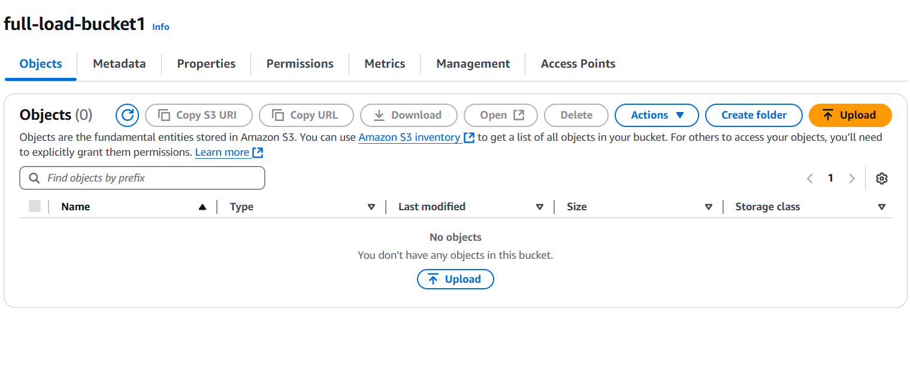
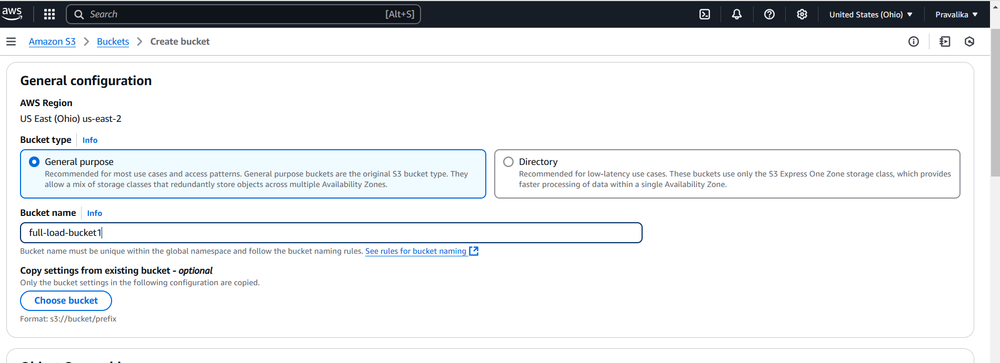
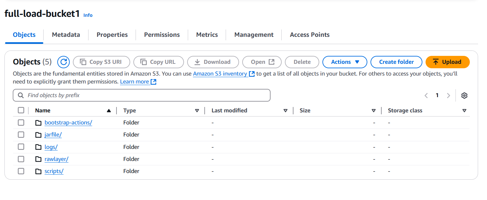

**AWS SERVICE - S3**

**INTRODUCTION:**

In this data lake pipeline project, the **Amazon S3 (Simple Storage Service)** is used as the main storage layer for raw and processed data. The project involves transferring data from a PostgreSQL database to S3 for storage and further processing. Amazon S3 provides scalable, secure, and durable storage, which is crucial for maintaining large datasets in a distributed data lake architecture.

**HOW TO CREATE S3 BUCKET:**

1. `   `**Creating a bucket with the name full-load-bucket1:**

CLI commad to create the bucket: aws s3 mb s3://full-load-bucket1 --region us-east-2

1. ` `**Creating folders:**

   CLI commands to create the folders –

   ` `aws s3 cp /dev/null s3://full-load-bucket1/rawlayer/stepfunction/ --region us-east-2

   ` `aws s3 cp /dev/null s3://full-load-bucket1/logs/ --region us-east-2

   ` `aws s3 cp /dev/null s3://full-load-bucket1/bootstrap-actions/ --region us-east-2

   ` `aws s3 cp /dev/null s3://full-load-bucket1/jarfile/ --region us-east-2

   ` `aws s3 cp /dev/null s3://full-load-bucket1/scripts/ --region us-east-2

` `**S3 BUCKET USAGE IN THE PROJECT:**

We used S3 as follows

- **Data Ingestion:** The pipeline extracts data from a PostgreSQL database using the Spark framework. The data is then loaded into S3 for storage and potential future use. This data is saved as a CSV file in the S3 bucket, which is defined by the variable BUCKET\_NAME. Here, the bucket name is "full-load-bucket".
- **Storage Layer:** S3 serves as the storage repository for both raw and processed data. Raw data from PostgreSQL is written to S3 in CSV format under the rawlayer/stepfunction path within the bucket. This approach allows raw data to be stored in a format that can later be used for analysis, transformation, or further processing.
- **Data Transfer to S3:** Once data is extracted from PostgreSQL using the Spark framework, it undergoes basic cleaning (such as transforming the questions list column into a comma-separated string). After that, the cleaned data is written to the specified S3 bucket. 

**ROLE OF AMAZON S3 IN THE DATA LAKE PIPELINE:**

Amazon S3 serves as the central repository for various data storage requirements in the pipeline, supporting both raw data storage and the output generated during the data processing stages.

Key roles of S3 plays in the project:

1. **Storing Raw and Processed Data:**
   S3 is used to store raw data fetched from PostgreSQL and store the processed results in an organized manner. Once the data is read from the PostgreSQL database via JDBC, it is stored in S3 in the rawlayer directory, ensuring that the data is securely stored and easily accessible for future processing.
   1. Input:** Raw data is fetched from the PostgreSQL database using the PySpark script and transferred to S3 for storage in CSV format.
   1. Output:** Processed data, after being transformed by the Spark job, is written back into S3 in CSV format for further use or analysis.
1. **Log Management:**
   S3 is used to store logs generated during the execution of tasks such as cluster creation, job execution, and cluster termination. These logs are crucial for tracking the status and progress of the pipeline, debugging issues, and auditing operations.
   1. Input: Logs generated by the EMR cluster (such as job progress and errors) are automatically written to the logs/ directory in the S3 bucket.
   1. Output: These logs serve as a valuable resource for monitoring and troubleshooting the pipeline.
1. **Storing Bootstrap Scripts:**
   Bootstrap scripts, such as the one used to install necessary dependencies (like boto3), are stored in S3 and executed when the EMR cluster is created. This allows for automated setup of required libraries and configurations during the cluster launch phase.
   1. Input: The bootstrap script (install-boto3.sh) is stored in the S3 bucket and used to install dependencies on the EMR cluster.
   1. Output: After installation, the dependencies are available for use by the EMR cluster during job execution.
1. **Storing Job Resources (JARs and Scripts):**
   S3 stores all the required resources for the Spark job, including the PostgreSQL JDBC driver and PySpark scripts. These resources are accessed by the EMR cluster when the job is executed, ensuring that the necessary files are available to run the job seamlessly.
   1. Input: The PySpark script (jdbc.py) and JDBC driver (postgresql-42.7.5.jar) are uploaded to S3.
   1. Output: These files are fetched from S3 by the EMR cluster and used during the Spark job execution to connect to PostgreSQL and process the data.

**STORAGE CLASS:**

**Types of storage classes in S3:**

Amazon S3 offers several storage classes, including S3 Standard, S3 Intelligent-Tiering, and S3 Glacier. 

The best storage class depends on how often you access your data. 

**S3 Standard:**

- The go-to class for frequently accessed data.
- Designed for general-purpose storage.
- Offers high durability, availability, and performance.

**S3 Intelligent-Tiering :**

- Optimizes storage costs by storing objects in two access tiers: one for frequent access. and one for infrequent access.

**S3 Glacier Flexible Retrieval:**

- Designed for cost-effective archival storage of data that is accessed infrequently.
- Ideal for long-term data storage with occasional or on-demand access requirements.

**S3 Glacier Deep Archive Storage Class:**

- The cheapest cold storage solution AWS has to offer. 
- Designed to provide durable and secure long-term storage for large amounts of data.

**One Zone-IA Storage Class:** 

- Designed for data that is used infrequently but requires rapid access.
- Indicated for infrequently accessed data without high resilience or availability needs.

In this project, we have used the **S3 Standard** storage class for the data that is frequently accessed and processed.

**SECURITY AND ACCESS MANAGEMENT:**

The pipeline uses AWS credentials to access the S3 bucket. It ensures that the data is securely stored and only accessible by authorized users or processes. Amazon S3 provides a range of security features to ensure that the data is protected. Access to the S3 bucket is controlled via IAM roles and policies, ensuring that only authorized users and services can interact with the data stored in the bucket.

- **Encryption:** S3 offers encryption at rest, meaning that all data stored in the bucket can be encrypted using S3-managed keys (SSE-S3) or customer-managed keys (SSE-KMS).
- **Access Control:** IAM roles are used to grant fine-grained access control to ensure that only specific users or services can access certain data. This is critical for protecting sensitive information stored in the bucket.

**AMAZON S3 PRICING:** 

Amazon S3 pricing is based on several factors, including storage used, requests made, and data transfer. 

**1. Storage Costs**

The cost for storing data in S3 is calculated based on the amount of data stored in the bucket. Pricing varies by the storage class you use. For example:

- **S3 Standard** (used for frequently accessed data):
  - First 50 TB / month: $0.023 per GB
  - Next 450 TB / month: $0.022 per GB
  - Over 500 TB / month: $0.021 per GB
- **S3 Glacier** (used for archival storage with retrieval times of minutes to hours):
  - $0.004 per GB (storage cost)
- **S3 Intelligent-Tiering** (used for automatically moving data between two access tiers):
  - $0.023 per GB for frequently accessed data
  - $0.0125 per GB for infrequently accessed data

` `**CONCLUSION:**

In this data lake pipeline, the S3 bucket plays a critical role in storing and managing data efficiently. It serves as the centralized storage location for raw and processed data extracted from PostgreSQL. By leveraging the scalability, durability, and security features of S3, the project ensures reliable and cost-effective data storage for further analytics or machine learning tasks.

Reference: Refer to the following link for ETL Pipeline for PostgreSQL to SQL using AWS EMR and Step Function: https://bitbucket.org/ivorsource/data-lake-pipelines/src/DE-1562/spark-emr-stepfunction-secretmanager/
