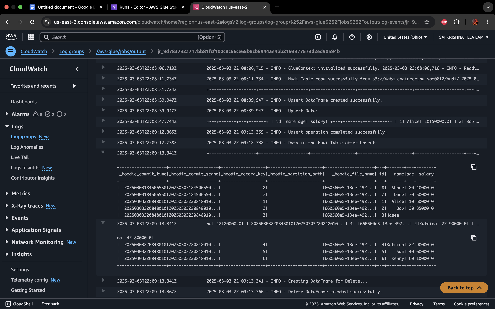
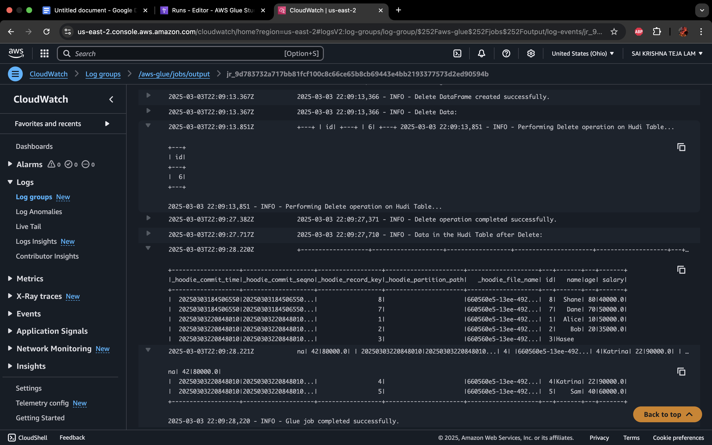
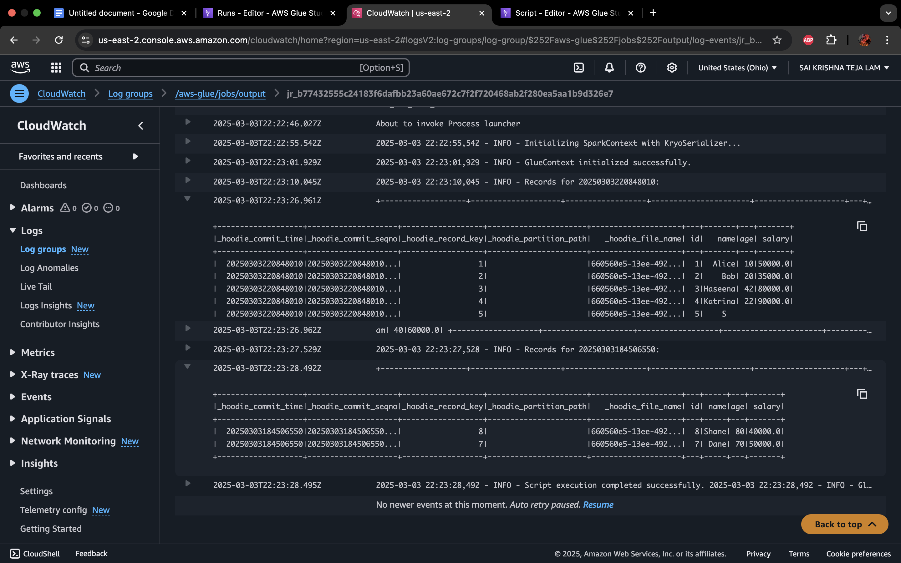
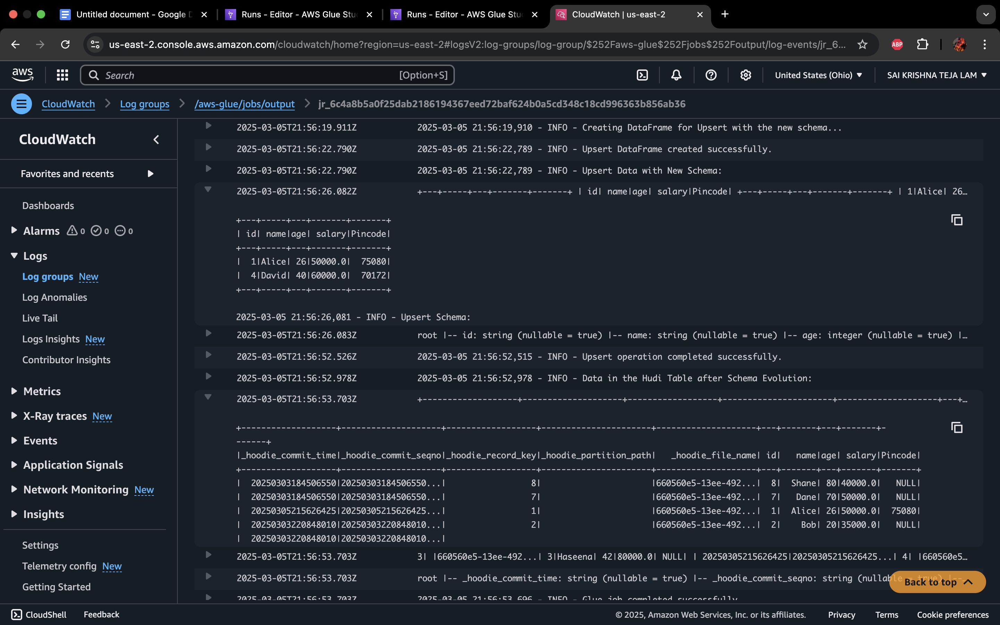

***Apache Hudi***

Apache Hudi (Hadoop Upserts Deletes and Incrementals) is an **open-source data lakehouse platform** used to simplify incremental data processing and data pipeline development on top of distributed data storage systems like Hadoop Distributed File System (HDFS) or cloud storage systems like Amazon S3. It provides a way to manage datasets stored in a Hadoop-compatible filesystem with efficient upserts (updates and inserts), deletes, and complex change streams.

***Key features of Apache Hudi include:***

1. **Upsert and Delete Capabilities**: It allows you to update and delete records in your data lake, making it easy to handle mutable datasets.  
2. **Transactional Support**: Hudi provides ACID transactions which ensure data integrity and consistency across large datasets.  
3. **Change Data Capture**: It can efficiently handle change data capture (CDC), which is essential for streaming data and log changes.  
4. **Snapshot and Incremental Queries**: Supports querying of data snapshots or changes, facilitating efficient data access for both point-in-time queries and incremental data changes.  
5. **Scalability**: Designed for large-scale performance and efficiency on big data platforms such as Apache Hadoop, Spark, and cloud platforms.  
6. **Data Layout Optimization**: Includes mechanisms like file sizing, compaction, and clustering to optimize data storage and query performance.  
   

***Integration of Apache Hudi:***

Apache Hudi can be integrated with a variety of processing frameworks to manage and process large-scale datasets efficiently. Hudi provides built-in support for several big data technologies, allowing it to be implemented in different computational environments. The main ways to implement Hudi include:

### **1\. Apache Spark**

Apache Spark is the most common integration for Hudi. Spark provides robust support for batch and real-time data processing. Hudi leverages Spark's capabilities for processing large datasets efficiently, handling tasks such as:

* **Upserting**, **inserting**, and **deleting** records in datasets stored in a Hadoop-compatible file system.  
* Managing data storage formats like Copy on Write (CoW) and Merge on Read (MoR).  
* Running compaction and cleaning operations to optimize data storage and access.  
* Utilizing Spark SQL for querying data stored in Hudi datasets.

Hudi integrates seamlessly with Spark's DataFrame and Dataset APIs, making it a preferred choice for Spark users to manage mutable datasets.

### **2\. Apache Flink**

Apache Flink is used for near real-time streaming data processing, and Hudi provides support for Flink to handle streaming data use cases. Flink integration allows for:

* Continuous and incremental data processing, which is essential for event-driven applications.  
* Stateful computations over data streams, which are ideal for scenarios where data changes frequently.  
* Managing time-based and complex event processing efficiently.

Hudi with Flink is suitable for scenarios that require managing large streams of mutable data with near-real-time requirements.

### **3\. Apache Hive**

Although Apache Hive is not a data processing framework like Spark or Flink, Hudi integrates well with Hive to provide batch processing capabilities. This integration allows:

* Querying data lakes using Hive SQL while benefiting from Hudi's upsert capabilities.  
* Managing data using Hive's metastore with Hudi's table services to keep track of table versions and metadata.

Hudi supports Hive synchronization to ensure that data in Hudi tables is readily queryable using Hive SQL without additional synchronization tools.

### **4\. Presto and Trino**

Presto and Trino (formerly PrestoSQL) are query engines that can query Hudi datasets efficiently. They are well-suited for interactive analytics queries over large datasets:

* They can query Hudi-managed datasets using SQL, providing powerful interactive analytics capabilities.  
* Integration allows for querying near real-time data along with historical data snapshots.


### 

### **5\. Cloud Platforms**

Hudi is compatible with cloud services like AWS EMR, Google Cloud Dataproc, and Azure HDInsight, which provide managed Spark and Hadoop environments. Hudi integrates into these services to leverage cloud storage such as S3, Google Cloud Storage, and Azure Blob Storage for large-scale data management.

**Integrating Apache Hudi with AWS Glue using Apache Spark involves setting specific Spark configurations to ensure that Hudi can manage the datasets effectively. When you're running your AWS Glue job with Spark and you need to integrate Hudi, you'll typically pass additional configurations through the Spark settings in the AWS Glue job parameters.**

### **Here are the steps to submit an AWS Glue job using the AWS CLI:**

**Step 1: Create a Glue Job**
``` sh
aws glue create-job \
    --name "sparkhudi" \
    --role "AWSGlueServiceRole" \
    --command "Name=glueetl,ScriptLocation=s3://your-bucket/scripts/job.py,PythonVersion=3" \
    --region us-east-1
```

## **Step 2: Start the Glue Job:**
``` sh
aws glue start-job-run \
    --job-name "sparkhudi" \
    --arguments '{"--datalake-formats":"hudi"}'
```
## **Step 3: Check Job Status:**
``` sh
aws glue get-job-run --job-name "sparkhudi" --run-id "jr_123456789"
```
## **Step 4: Stop a Running Job:**
``` sh
aws glue stop-job-run --job-name "sparkhudi" --run-id "jr_123456789"
```

### **Here are the steps to submit an AWS Glue job using the AWS Console:**

### **Step 1: AWS Glue Job Setup**

When setting up your AWS Glue job:

* Choose a **Spark** job type.  
* Use a **Python shell** or **Spark script** depending on your codebase.  
* Ensure your Glue version is compatible with the Spark and Hudi versions you intend to use.

### **Step 2: Job Parameters**

You'll need to pass additional job parameters to configure the Spark environment for Hudi. Here are the typical parameters you might set:

* **`--datalake-formats		hudi`**

### **Step 3: S3 Bucket**

### **Loading Data Into HUDI Table:**

To effectively utilize Apache Hudi within AWS Glue and Spark, it's crucial to have an Amazon S3 bucket set up as the storage location for your Hudi tables. S3 provides a highly durable, scalable, and secure object storage solution that integrates seamlessly with AWS Glue and Spark. By storing Hudi tables in S3, you can leverage its distributed architecture to handle large volumes of data with ease. This setup allows for efficient data management practices such as upserts, deletions, and incremental reads, ensuring that your data lake remains robust and performant. Additionally, using S3 as a storage layer facilitates the integration of other AWS services, enhancing the overall analytics and data processing workflows within your environment.

1\. Create an S3 bucket using the AWS CLI:

``` sh

aws s3api create-bucket \--bucket your-bucket-name \--region us-east-1

```

**MAKE SURE THAT YOUR  BUCKET NAME IS UNIQUE IN ENTIRE AWS REGION.**

2.Create subfolders in the bucket for data :

``` sh  
aws s3api put-object \--bucket your-bucket-name \--key hudi/data/ 

```

**Script Used For Loading And Deleting Data:** (https://bitbucket.org/ivorsource/sparkstreamingpipeline/src/DE-1579/HudiScripts/AcidTransactions\_Hudi.py)

The script is designed to manage and manipulate a Hudi table stored in an Amazon S3 bucket, leveraging AWS Glue and Apache Spark. It begins by initializing the Spark context with specific configurations to support Hudi operations. The script then reads an existing Hudi table, displaying the initial data, which demonstrates the ability to handle ACID transactions typical in databases but now applied to a data lake environment.

The core functionality revolves around performing "upsert" operations, where new data is either inserted or updated if it already exists, demonstrating Hudi's powerful handling of mutable data sets in a distributed environment. After updating the data, the script reads and shows the modified Hudi table to verify the changes, ensuring data integrity and showcasing Hudi's snapshot capabilities.

Additionally, the script handles delete operations, where specified records are removed from the dataset, further emphasizing the ACID transaction capabilities of Hudi within a data lake, and concludes by reading and displaying the final state of the data. This end-to-end process not only highlights the practical application of Hudi in managing large-scale data with transactional integrity but also the seamless integration with cloud-native technologies like AWS Glue and S3 for robust data processing workflows.

### **Snapshot of data loading into HUDI:**



### **Snapshot of data being deleted from HUDI:**


### **Time Travel:**

**Script Used For Time Travel:** (https://bitbucket.org/ivorsource/sparkstreamingpipeline/src/DE-1579/HudiScripts/TimeTravel.py)

This script initializes a Spark and AWS Glue environment, configures logging, and reads data from a Hudi table stored in an S3 bucket. The script is set up to use the KryoSerializer for efficient data serialization and the Hudi catalog for querying the table. It defines a function to query records from the Hudi table based on a specific commit time (provided as `query_date`) and logs the results. The script queries the table for two different commit times and prints the records. After execution, it logs the completion of the Glue job. The purpose is to retrieve and log specific records from a Hudi table stored on S3, based on commit timestamps.

Time travel in Hudi is a powerful feature that allows you to query and analyze historical data. Here are some key points on how time travel is useful in Hudi:

1. **Data Consistency**: Time travel allows you to access historical versions of your data, ensuring that you can retrieve the state of the data as it was at a specific point in time. This is particularly useful when dealing with large datasets where data is continuously updated.  
2. **Audit and Compliance**: You can use time travel to track changes made to your data over time, which is beneficial for auditing and meeting regulatory compliance requirements. It provides transparency by allowing you to query historical versions and view any modifications.  
3. **Data Recovery**: In case of accidental data deletion or corruption, time travel enables you to revert to a previous version of the dataset, ensuring data recovery without requiring manual intervention.  
4. **Testing and Debugging**: Time travel allows data engineers and developers to reproduce past scenarios by querying data at specific points in time. This is helpful for testing and debugging, as it ensures that the dataset reflects the exact state during testing.  
5. **Versioned Data Analysis**: Time travel makes it easier to perform versioned data analysis, helping you compare different versions of the data over time. This is useful in trend analysis, tracking changes in business metrics, and performing time-based calculations.  
6. **Simplified Data Pipelines**: Time travel simplifies building data pipelines that require historical data. It enables users to easily fetch data from past points, streamlining pipeline design without the need for manual version control.  
7. **Rollback Support**: When a batch job or data update causes issues, time travel in Hudi allows you to roll back to the previous, stable state of the data, ensuring minimal disruption to business operations.  
8. **Change Data Capture (CDC)**: Time travel is useful for implementing CDC, where you can track and query changes made to the data over time, enabling real-time analysis and reporting of data changes.  



### **Schema Evolution:**

**Script Used For Schema Evolution:** (https://bitbucket.org/ivorsource/sparkstreamingpipeline/src/DE-1579/HudiScripts/SchemaEvolution.py)

In this script, schema evolution is implemented when new data with a different schema (i.e., an additional column) is upserted into an existing Hudi table. The script begins by defining an initial schema for reading the Hudi table, then defines a new schema that adds a `salary` column to the dataset. It demonstrates schema evolution by performing an upsert operation where new data is inserted with the updated schema (which includes the new column). The upsert is then executed, and the Hudi table is updated with the new schema. The updated table is read back, showing both the data and the schema, confirming the addition of the new column (`salary`). This allows the table to evolve dynamically without requiring schema changes to be manually applied, enabling flexibility in handling changing data structures.

Schema evolution in Apache Hudi is a powerful and essential feature that allows for seamless management and updates to the schema of data stored in Hudi tables, making it highly flexible for real-time data engineering workflows. Here are some reasons why schema evolution is considered powerful in Apache Hudi:

1. **Dynamic Schema Changes**: Hudi allows for automatic handling of schema changes, such as adding, removing, or modifying columns, without requiring a full rewrite of the existing data. This is crucial for evolving datasets that may change over time due to new requirements or changes in data structure.  
2. **Backward and Forward Compatibility**: Hudi supports both backward and forward compatibility in schema evolution. This means that new data can be ingested with updated schemas, while older data with the previous schema remains accessible. This allows for smooth transitions when evolving data models, without breaking downstream applications.  
3. **Efficient Storage Updates**: Schema evolution in Hudi is efficient because it performs minimal updates to the data, typically only applying changes where necessary. For example, new columns can be added to existing records without needing to rewrite the entire dataset, which significantly reduces storage and computational overhead.  
4. **Support for Complex Data Types**: Hudi supports schema evolution with complex data types, such as nested structures, arrays, and maps. This enables flexibility when working with semi-structured or hierarchical data, as it allows schema modifications without disrupting the integrity of the dataset.  
5. **Integration with Data Lakes**: Hudi’s schema evolution works seamlessly with data lakes, particularly when data is stored in cloud storage like S3. The feature enables real-time ingestion, querying, and updating of data in data lakes, which is vital for large-scale, distributed systems.  
6. **Real-Time Data Processing**: As Hudi supports schema evolution in combination with its powerful upsert and incremental processing capabilities, it enables real-time processing of evolving datasets, where new records may arrive with a slightly different schema than the existing data.  
7. **Versioning and Time Travel**: Schema evolution in Hudi is tightly integrated with time travel and versioning. You can query historical versions of your data while still allowing schema changes over time. This is useful for auditing, debugging, or recovering previous versions of the data after schema changes.  
8. **Ease of Use**: Hudi’s schema evolution is straightforward to implement. Data engineers can define new schemas and Hudi will automatically handle the migration of data without the need for complex manual interventions. This reduces the burden of managing changing schemas in large, dynamic datasets.

