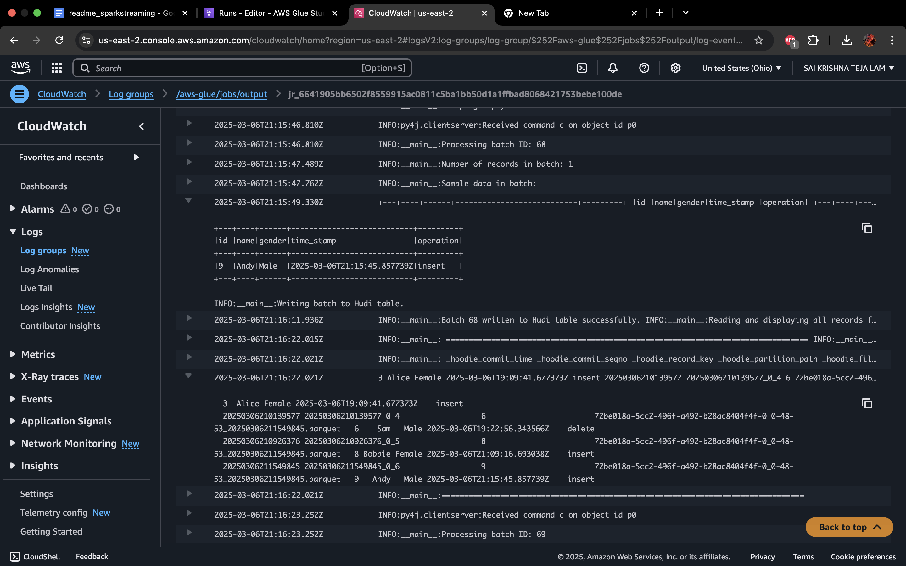

**Real-Time Streaming ETL Pipeline with AWS and Apache Hudi**

## **Project Overview**

This project implements a real-time data streaming pipeline to capture and process Change Data Capture (CDC) events from a PostgreSQL database. The processed data is stored in Amazon S3 using Apache Hudi to enable incremental updates and time travel. The pipeline leverages AWS services such as DMS, Kinesis, Glue, and S3 to handle high-throughput data ingestion, processing, and storage efficiently.

**Prerequisites:**

1) [**Relational Database ( Postgres )**]  
2) [**Data Migration Service**]  
3) [**Kinesis**]
4) [**AWS Glue**]
5) [**Apache Hudi**]
6) [**S3**]

## **Why This Pipeline?**

Traditional batch ETL pipelines face challenges with real-time data processing, data consistency, and handling updates/deletes effectively. Storing large volumes of data using conventional file formats (like Parquet) can lead to high processing times and difficulty in managing schema changes.

### **Why Real-Time?**

* Need to reflect near-real-time changes in analytical dashboards.  
* Minimize data latency for decision-making.  
* Avoid data inconsistencies due to out-of-sync batch updates.

### **Why Apache Hudi?**

* Enables efficient upserts and deletes on large datasets.  
* Provides ACID compliance on data stored in S3.  
* Supports schema evolution and time travel for historical analysis.

## **How It Works**

### **1\. Source: PostgreSQL on Amazon RDS**

* PostgreSQL serves as the primary data source.  
* Logical replication is enabled to capture CDC events.

### **2\. AWS DMS**

* AWS Database Migration Service (DMS) captures CDC events using a replication slot and streams them to Amazon Kinesis.

### **3\. Amazon Kinesis**

* Kinesis serves as the streaming platform to handle high-throughput event ingestion.  
* The data stream is partitioned and scaled based on expected volume.

### **4\. AWS Glue (Apache Spark)**

* Glue job (using Spark) reads data from Kinesis in micro-batches.  
* Processes CDC events (INSERT, UPDATE, DELETE) and maps them to Hudi-supported formats.  
* Writes data to S3 using Apache Hudi in COPY\_ON\_WRITE (COW) mode.

### **5\. Apache Hudi**

* Hudi handles record-level updates and deletes in S3.  
* Enables schema evolution and time travel.

### **6\. Amazon S3**

* Serves as the data lake for long-term storage.  
* Data is stored in partitioned Parquet files for efficient querying.

**How To Set It Up**

To set up this pipeline, start by creating a PostgreSQL instance on Amazon RDS with logical replication enabled. Create a publication and a replication slot to capture CDC events. Next, configure AWS DMS by setting up a replication instance and data migration task along with defining the source (PostgreSQL) and target (Kinesis) endpoints. Start a DMS task to stream CDC events into an Amazon Kinesis data stream, making sure to configure the number of shards based on the expected data volume. Once the Kinesis stream is running, create an AWS Glue job using Spark to read data from Kinesis in micro-batches and process to store in S3.

***Script Location \- *** 

This AWS Glue script sets up a real-time streaming ETL pipeline to process Change Data Capture (CDC) events from Amazon Kinesis and store them in Amazon S3 using Apache Hudi. The script begins by configuring Spark and Glue contexts with Hudi-specific extensions and serializers. It defines a schema for incoming JSON data, including both data fields (like id, name, gender) and metadata fields (like operation, table-name, and timestamp). The script reads binary data from the Kinesis stream, converts it to JSON, and extracts the required fields. It filters out any records with missing values and logs sample data for debugging. The script processes data using Spark�s foreachBatch() method, where each batch is written to a Hudi table in COPY\_ON\_WRITE mode. The Hudi configuration ensures that data is upserted based on the id field and precombined using the time\_stamp field. After writing the data, the script reads back the Hudi table to confirm successful writes and logs the table contents for verification. The streaming query runs continuously, processing new data as it arrives in Kinesis.

